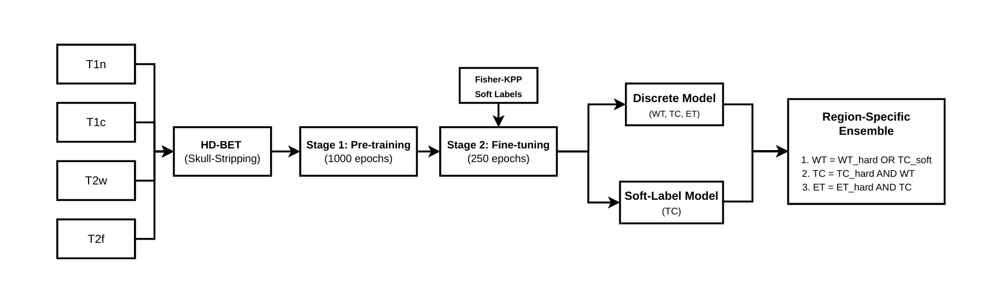

# BraTS-PEDs 2026 - Task 2 | Team NeuroSapiens

[](https://www.synapse.org/)
[]()

Official repository for the inference pipeline of **Team NeuroSapiens** (Submission ID: `9774214`) for the BraTS-PEDs 2026 Task 2 Challenge.

This repository provides the containerized inference code used to evaluate our models, featuring a custom 5-fold ensemble, soft-label probabilistic guidance, and a novel Topology-Aware Logic Refinement.

---

## Overview & Pipeline

Our approach tackles the complexities of pediatric glioma segmentation by relying on a robust cascaded architecture combined with custom post-processing to avoid anatomical inconsistencies.

1. **Base Architecture:** 5-fold nnU-Net ensemble (Cascade 502 → 501).
2. **Probabilistic Guidance:** We integrate a Soft-Label Model (Trainer: `nnUNetTrainerSoftWT_lowLR`) to inject uncertainty maps for the Tumor Core (TC).
3. **Intensity Logistic Regression:** Applied specifically for the Cystic Component (CC) mapping using T1c and T2w modalities (Threshold > 0.90).
4. **Hierarchical Logic Refinement:** A custom boolean post-processing step to dramatically reduce Edema (ED) over-segmentation.



---

## Topology-Aware Post-processing (Hierarchical Logic)

Pediatric gliomas often suffer from geometric overlapping, where the model defaults ambiguous core regions to Edema (ED). We implemented a strict boolean hierarchy to force the soft-label predictions to be classified as core, preventing them from leaking into the edema mask:

```python
# Hierarchical Logic implemented in predict.py
wt = wt_hard | soft_wt_add
wt = filter_components(wt, MIN_COMPONENT)
tc = (tc_hard | soft_wt_add) & wt      # Soft contribution strictly counts as core
et = et_hard & tc
edema = wt & ~tc                       # Edema is strictly the remainder of WT
```

---

## Validation Impact (294 OOF cases)

This topological constraint yielded a massive reduction in False Positives (FP) for Edema without degrading the Whole Tumor (WT) integrity:

| Region | Dice (Before) | Dice (After) | Delta | Precision (After) | FP Edema (Before) | FP Edema (After) | FP Reduction |
|--------|---------------|---------------|--------|--------------------|--------------------|--------------------|----------------|
| ED | 0.5089 | 0.5661 | +0.0572 | 0.5803 | 926,413 voxels | 593,119 voxels | -36.0% |
| TC | 0.8711 | 0.8821 | +0.0109 | 0.8937 | — | — | — |
| CC | 0.2825 | 0.3023 | +0.0197 | 0.7311 | — | — | — |
| WT | 0.9074 | 0.9074 | 0.0000 | 0.9204 | — | — | — |

> **Nota:** los FP de NETC filtrados hacia Edema bajaron de 521k a 308k, y los FP de CC bajaron de 99k a 40k.

---

## Repository Structure

- `predict.py` — Main inference script containing the pipeline and the Hierarchical Logic. Reads from `/input`, writes to `/output`.
- `Dockerfile` — Environment definition (CUDA 12.8, PyTorch 2.8, nnU-Net 2.8.1).
- `trainers/` — Custom nnU-Net trainers required to load the Soft-Label models.
- `research_scripts/` — Historical archive of our calibration, hyperparameter sweeping, and validation scripts (Not required for Docker inference).

> Due to GitHub storage limits, the ~1.3 GB model checkpoints in the `models/` directory are not included in this repository. Ensure they are mounted or copied before building the image.

---

## Reproducibility: Docker Usage

### 1. Build the image

Ensure your model checkpoints are placed in the `./models/` directory, then build the container:

```bash
docker build -t bratsped-neurosapiens:latest .
```

### 2. Local Testing (BraTS Strict Environment)

To replicate the exact Synapse evaluation environment (read-only input, no network access, flat output structure):

```bash
docker run \
  --rm \
  --network none \
  --gpus=all \
  --volume /path/to/Validation_Data:/input:ro \
  --volume /path/to/local_output:/output:rw \
  --memory=48G --shm-size=16G \
  bratsped-neurosapiens:latest
```

### 3. Output Verification

The pipeline outputs exactly one `.nii.gz` per case directly in the root of the `/output` folder (no subdirectories).

Official label mapping:

- `1` = ET (Enhancing Tumor)
- `2` = NET (Non-Enhancing Tumor)
- `3` = CC (Cystic Component)
- `4` = ED (Edema)
